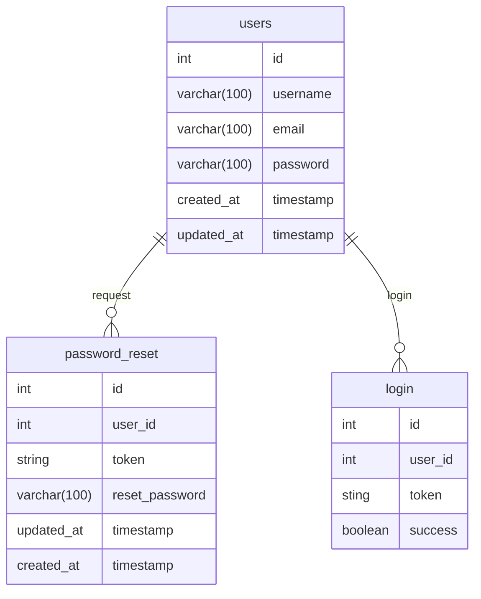

# ERD SISTEM AUTHENTIFICATION FLOW

```mermaid
erDiagram

users{
    int id
    varchar(100) username
    varchar(100) email
    varchar(100) password
    created_at timestamp
    updated_at timestamp
}

password_reset{
    int id
    int user_id
    string token
    varchar(100) reset_password
    updated_at timestamp
    created_at timestamp
}

login{
    int id
    int user_id
    sting token
    boolean success
}

users ||--o{ password_reset : "request"
users ||--o{ login : "login"


```